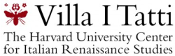
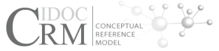

<main class="home">
	

		<section class="home-section" id="info">
			

				<h1>{Distributed}  Digital Research  Infrastructures  for the Humanities</h1>
			

			

				

					
					<h2>Harmonization</h2>
					
The Consortium for Open Research Data in the Humanities is committed to harmonizing data standards and infrastructures to facilitate interoperability and the cross-pollination of research data.

				

				

					
					<h2>Integration</h2>
					
The consortium aims to contribute to a vibrant culture of open scholarship and collaboration among researchers, disrupting barriers posed by proprietary databases where information is kept in silos.

				

				

					
					<h2>Open</h2>
					
We seek to advance the global paradigm shift in publishing models, away from inward looking, closed and costly strategies, towards an open and inclusive model that encourages collaboration and open-access.

				

			

		</section>
		<section class="home-section" id="partners">
			

				<h1>Partners</h1>
				<!-- 
We seek to advance the global paradigm shift in publishing models, away from inward looking, closed and costly strategies, towards an open and inclusive model that encourages collaboration and open-access.
 -->
			

			

				

				

				

				

				

			

		</section>
		<!--
				<section class="home-section" id="news">
						

								<h1>News</h1>
						

						

								
								
										
										<article class="post column">
												
												<a href="{{ site.url }}{{ site.baseurl }}/category/{{ post.category }}" class="post-categories">
														{{ post.categories }}
												</a>
												<a class="post-link" href="{{ post.url | prepend: site.baseurl }}">
														<h2 class="post-title">{{ post.title }}</h2>
												</a>
												<a class="post-link" href="{{ post.url | prepend: site.baseurl }}">
														

																{{ post.introduction }}
														

												</a>
										</article>
										
								
						

						

								<a href="{{ site.url }}{{ site.baseurl }}/news/" class="button">News</a>
						

				</section>
		-->
		<section class="home-section" id="collaborators">
			

				<h1>Collaborators</h1>
			<!--		
We seek to advance the global paradigm shift in publishing models, away from inward looking, closed and costly strategies, towards an open and inclusive model that encourages collaboration and open-access.

-->
			

			

				

				

 
				

			

		</section>
	

</main>
